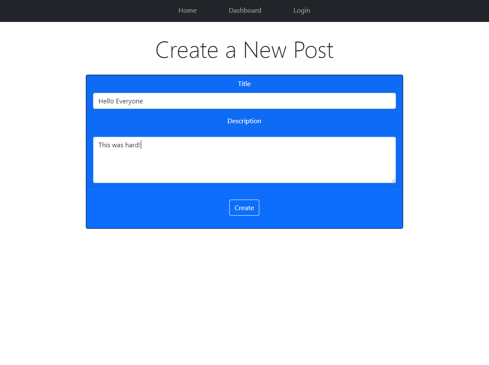
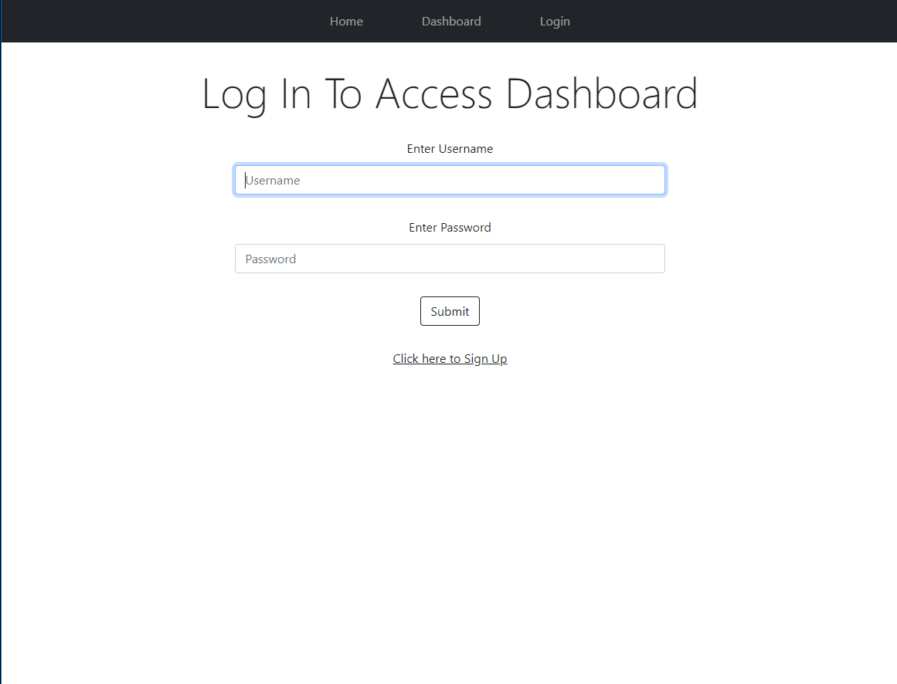

  
  
  # tech-blog
  

  ## Table Of Contents

  * [Description](#description)

  * [Installation](#installation)

  * [Usage](#usage)

  * [License](#license)

  * [Contributors](#contributors)

  * [Tests](#tests)

  * [ScreenShots](#screenshots)

  * [Links](#links)

  * [Questions](#questions)

  ## Description

  This application allows users to view, create, update, and delete posts and comments. Users can get full access to the site by logging in. Then they will have the ability to customize their posts and comments.
  
  ## Installation

  To run this application properly, you need to install:
  
  Node.js, Express, bcrypt, sequelize, MySQL2, express-session, dotenv, Heroku
  

  ## Usage
  
  Clone from the repository   Navigate to project folder in terminal  Enter npm i Create the .env file  Inside the .env file type DB_Name=techblog_db DB_USER="Your root name for mysql" DB_PASS="Your root password"  Enter npm start  Or to use the application follow the link below
  
  
  ## License
  
  This Project is licensed by [MIT](https://choosealicense.com/licenses/mit/).
  
  ## Contributors

  Tom Lazore - Contact info below
  
  ## Tests
  
  To test this application, enter Comments still need work. in the command line

  ## ScreenShot

  
  
  

  ## Links

  [Live Application](https://cryptic-thicket-49114.herokuapp.com/)

  [Project Repository](https://github.com/tlaze/tech-blog)
  
  
  ## Questions

  If you have any questions, comments, or issues feel free to contact Tom Lazore directly through
  
  Email: tomlazore@gmail.com

  or check out my [GitHub](https://github.com/tlaze)

  
